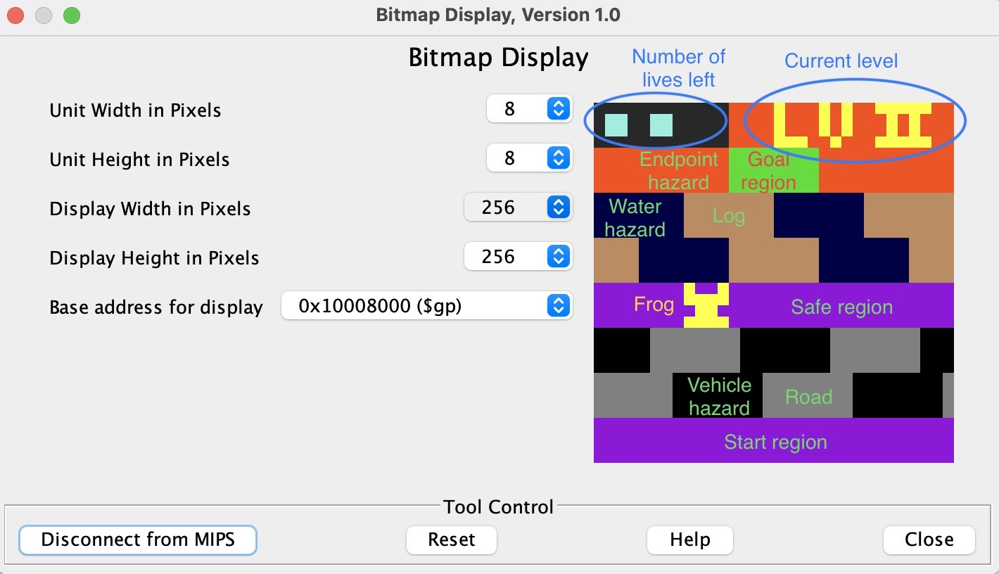

# forg-game
A Frogger game written in Assembly

# Gameplay
- There are two levels in the game
- Your goal is to move to the goal region in each level without depleting your lives
- Use keys WASD to move

# Starting the game
1. [Download MARS](http://courses.missouristate.edu/kenvollmar/mars/)
2. Open the .asm file using MARS
3. Click `Tools` &rarr; `Bitmap Display`, set the values to match the gameplay picture above, then press `Connect to MIPS`
4. Click `Tools` &rarr; `Keyboard and Display MMIO Simulator`, then press `Connect to MIPS`
5. Click `Run` &rarr; `Assemble` to assemble the code
6. Click `Run` &rarr; `Go` to start the game
7. Type on the keyboard simulator to move
8. When game is finished, repeat steps 5 and 6 to restart
